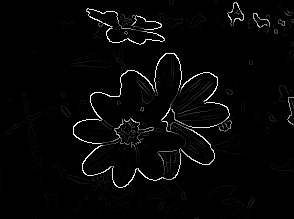
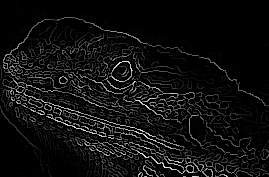
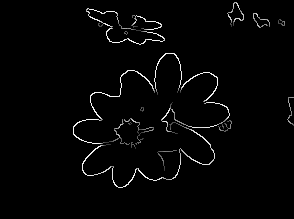
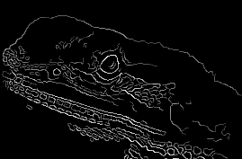

# canny-edge-detection
Sobel and Canny edge detection from scratch. Featuring a simple convolution algorithm, gaussian blur, non-maximum supression, and threshold hysteresis.

## Examples

	
	

Original Images

	
	

Sobel Output

Canny's Edge Thinning

	
	

Canny's Threshold Hysteresis

	
	

