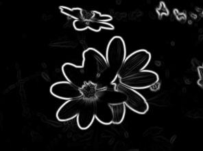

# canny-edge-detection
Sobel and Canny edge detection from scratch. Featuring a simple convolution algorithm, gaussian blur, non-maximum supression, and threshold hysteresis.

## Examples

Original Images

Sobel Output

Canny's Edge Thinning

Canny's Threshold Hysteresis

